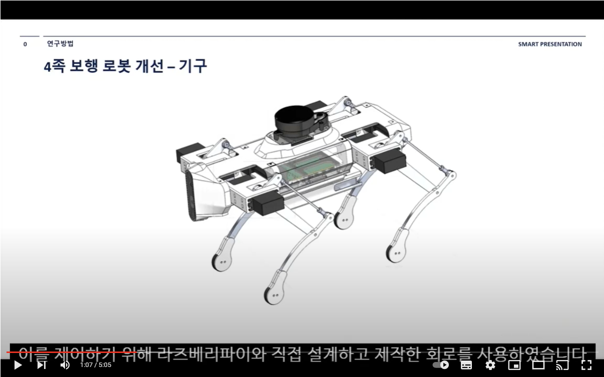
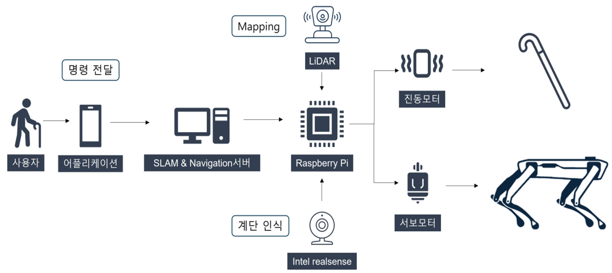

<!-- # SLAM-AI-Based-Guide-Quadruped-Robot-
SLAM &amp; AI-Based Guide Quadruped Robot System for the Blind
-->

# Universal Design Kiosk
|목록|내용|
|-------|-------|
|담당 Skills & 사용 Libraries| Dart, Firebase, Flutter|
|진행 기간| 2021/07/30 → 2021/12/31|
|팀 구성| Motor control & APP 1명, 인공지능&회로 1명,SLAM & ROS 1명 기구 1명,|
|한 줄 소개| 저조한 안내견 보급률 문제를 해결하고자 안내견을 대체할 4족 보해 로봇 시스템을 제안합니다.  길안내를 위해 Slam 및 Navigation시스템을 구성하고 로봇과 사용자의 상호작용을 위한 Application및 스마트 지팡이 또한 개발  하였습니다.|

### 🔗Link


**youtube**

<a href="https://www.youtube.com/watch?v=5R0DiJCty_U&feature=youtu.be"></a>

[https://www.youtube.com/watch?v=5R0DiJCty_U&feature=youtu.be](https://www.youtube.com/watch?v=5R0DiJCty_U&feature=youtu.be)

## 📖 상세 내용

   

  


```

🐷 SMART에서 활동 2학년 2학기 창의과제응용 프로젝트
현재 사물의 판단이 어려워 주변 사람이나 보조 기구의 도움이 필요한 중증시각장애인의 수는 약 5만 명에 달합니다. 
하지만 이러한 시각장애인의 보행을 도와주는 시각장애인 안내견의 수는 약 200마리로 보급률이 0.4%밖에 되지 않습니다. 
또한, 안내견 한 마리를 분양하기까지 비용은 대략 1∼2억 원, 기간은 2년이 필요해 전 세계적으로 안내견 보급은 매우 저조한 편입니다.
이러한 문제를 해결하기 위해 안내견을 대체할 4족 보행 로봇 시스템을 구현 하였습니다. 
길 안내를 위한 ROS 기반의 SLAM 및 Navigation 시스템을 구성하고 로봇과 사용자의 상호작용을 위한 Application 및 스마트 지팡이 또한 개발 하였습니다.

```

## 🛠️ 사용 기술 및 라이브러리
- **Raspberry Pi(Ubuntu18.04, ROS melodic)**
- **SLAM (Cartographer) & Navigation**
- **Firebase Real Time Database**
- **Android Application (Java)**
- **ServoMotor Control**
- **Circuit making**
- **mechanism design (SolidWorks)**


## 📱 담당한 기능 (App)

- **서보모터 제어, 4족 보행 로봇 제어**
- **Android ROS 데이터 연동 및 App 개발**
- **계단보행 구현**
